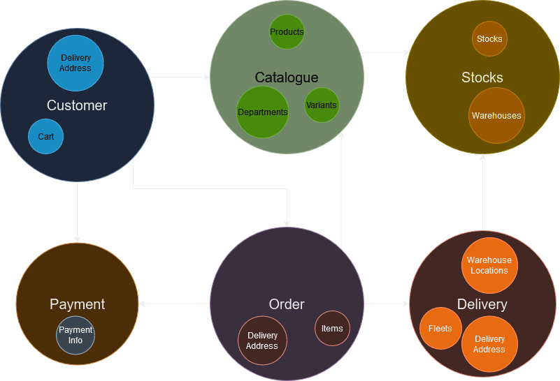
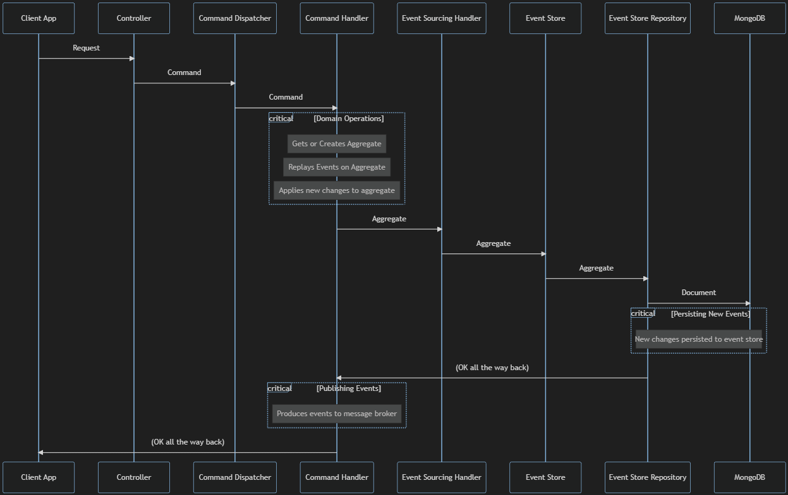
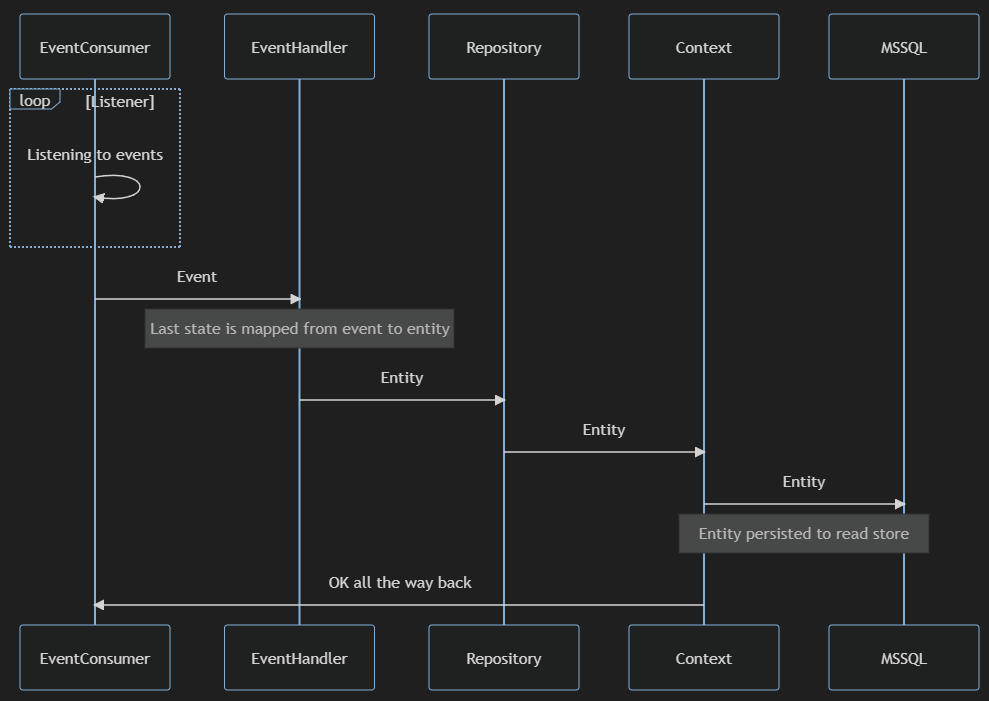

Yes, I just started learning microservices, years later it became big. Because a) I tend to procrastinate learning big topics to give them enough time and attention b) I want to see that they are not a FAD before sparing it time c) I already got a lot of learning going on d) I did not really need it and if I'm not applying stuff daily, I forget them easily.

Recently I completed a 8.5 hours course on udemy. I wrote all the code with the instructor step by step(which of course I can not share publicly). Debugged through it. Summarized it here the way I understood it for whom interested and myself for future references. 

This post looks at microservices from a higher level. Implementation details and tools used are not explanied.

**Disclaimer; These are only my opinions. They can be wrong or arguable. Give me a shout to discuss with me or correct me.**

## Lets start with Domain Driven Design
It's a decades old paradigm that became more popular with microservices.

It suggests grouping functional requirements of our software inside Bounded Contexts(I'll refer to them as BC from now on), where related stuff sit together(High Cohesion).

BC's are effectively namespaces and Aggregate's live inside them. Aggregates, aggregate properties from data and expose the domain functions.

In DDD, an approach called ubiquitous language is used. It is basically a lexicon of terms in a very non technical level. So everyone can attend domain modelling sessions and domain code can be understood, even written by none programmers.

### An example
Lets say we have an online store. We have a catalogue of products and stocks at various locations. Customers adds items to their cart and when they pay, an order is created. After order, Deliveries are created. I basically spotted six BC's here and they would look like this from a very surface level.

|  | 
|:--:| 
| *You can understand from the colour palette that design is not my strongest suit. Drawn with app.diagrams.net.* |

1. Customer browses the catalogue of items that have stocks.
2. Customer pays for items. Payment info is persisted and as a next step, order is created. 
3. When order is created, an event is created to create deliveries. *Actually, all interactions between services will happen through events. More on it later*
4. Delivery service creates pick-up's from warehouses, creates drop off's to delivery addresses and deducts stocks.

## What is microservices and why use it
Microservices is an enterprise design pattern where you create a backend service(actually two, one for read one for write. more on it later) for each BC. DDD is super important in context of microservices because it draws borders of BC's and effectively services.

With microservices you get; independent teams, independent deployments, independent codebases, independency in scaling, independency in failure, independency in monitoring, independency in storing. In short, a lot of independency. 

In return you also get; a lot of complexity, repetition, developers bound to domains, huge need for observability, big infrastructure needs and I saved the worst for the last: Distributed Transactions.

In short, microservices are beneficial;
* if you have complex domains that require a lot of people to work on them independently. 
* if you have at least thousands of users that use a moderate number of different functions of your app.

Microservices solve a lot of problems in the right context. But they should be seriously considered before using them. 

Recently, Amazon Prime Video decided to return to monotlith from microservices. I suggest you to take a look at it. Might be good points there for those who are considering to go with microservices.

## Constraints
* Microservices should not share code or data. Each service must have their dedicated codebase and database.
* They can not directly communicate. Communication must be through message brokers.

## Event Sourcing
We usually store the latest state of the data in our relational databases. Storing the final state makes it impossible to see how the data changed in it's lifetime. In some businesses like finance, tracking this changes can be super important.

Event sourcing here comes to help.

It is basically storing the events rather than the states and aggregating states out of events when needed.

## CQRS
Here is two very general software principles;
* A method must do one thing and one thing only. It should not do anything else. It should not have side effects.
* A method must either change a data or return a data.

They can't be precisely dated back to anyone I believe, but you can read these in the Clean Code by Bob Martin.

CQRS takes these to the extreme.

Basically, you separate your read actions(GET) and write/update/delete actions(POST, PUT, DELETE) into different api's.

This is a useful pattern since separating read and write helps you scale them independently.

## Combining Event Sourcing and CQRS
When a command hits the command api, after being processed by the aggregate, it is persisted to event store(usually nosql) then written to a message broker.

Read api consumes this event, replays the events on it's side and persists the materialized last state into the read database(usually rdbm).

With this;
* We have a log of events. Everything can be traced back. You can even re-generate read database from the event store.(I tried. It worked like magic)
* Write is very fast because it is append only. Read is very fast because it is materialized for final view.
* Write and read does not affect each other and can be scaled independently.

## Command Flow
Here's a sequence diagram that roughly shows what happens when client app sends a Command(POST, PUT or DELETE) to the Command Api.

|  | 
|:--:| 
| *Sequence diagram of command flow. Drawn with mermaid.js.* |

## Event Handling
When new events are published to a message broker, Read Api consumes this message and flow below occurs.

|  | 
|:--:| 
| *Sequence diagram of event flow. Drawn with mermaid.js.* |

# Wrap
* Basically, if you have a lot of domains and/or teams and/or users, Microservices can be a good fit to develop and scale your application independently. 

* Microservices architecture is a very complex pattern to respond to huge scalability needs. So they must be considered seriously before moving on.

* A good implementation and understanding of DDD is needed when tearing down functions to BC's and eventually microservices. 

* Storing the events separately with Event Sourcing, will prove useful when you need to trace back transactions.